# EBoost - Product Stock Notify

## Overview

This simple module allows the store admins to view subscribers for out of stock notifications and allows  add a stock notification for products in the product list page

## Features

+ View subscribers that registered to receive out of stock notifications
+ Turn on/off the notify stock button for product in product list page
+ Turn on/off the notify stock button for product in product detail page
+ Subscriber/un-subscriber for out of stock notifications on frontend
+ Support Ajax and Login popup

## Installation

Require the module

```bash
composer require eboosttech/magento2-stock-alert
```

Run setup to install module

```bash
php bin/magento setup:upgrade
```

Run comandline below to deploy

```bash
php bin/magento setup:static-content:deploy
```

## Usage

### View subscribers for out of stock notifications

You can go to `Eboost > Stock Notification Subscribers` to view subscribers for out of stock notifications

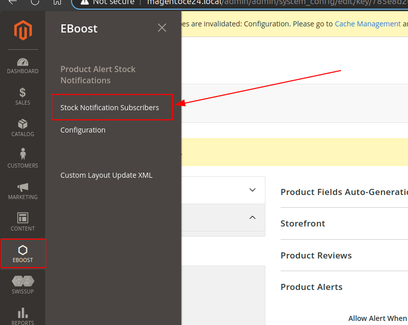
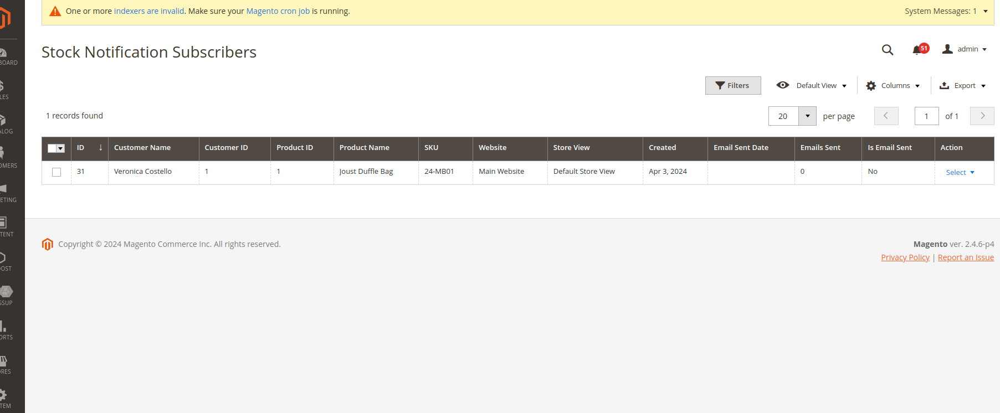

### Show notify button for product list page | product detail page

- Go to `Eboost > Configuration` to setup

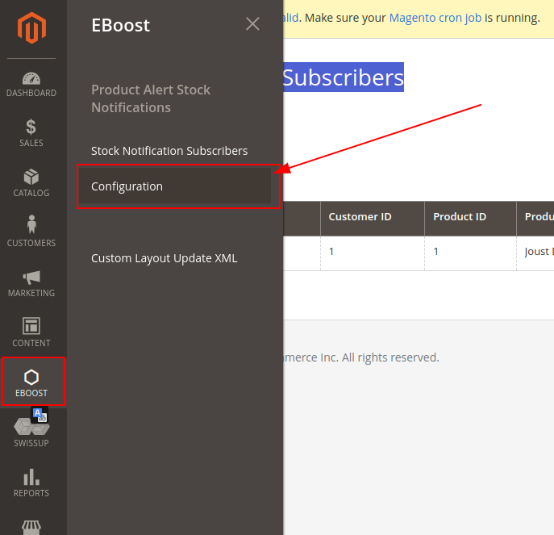

- Go to `Product Alerts` section and expand it

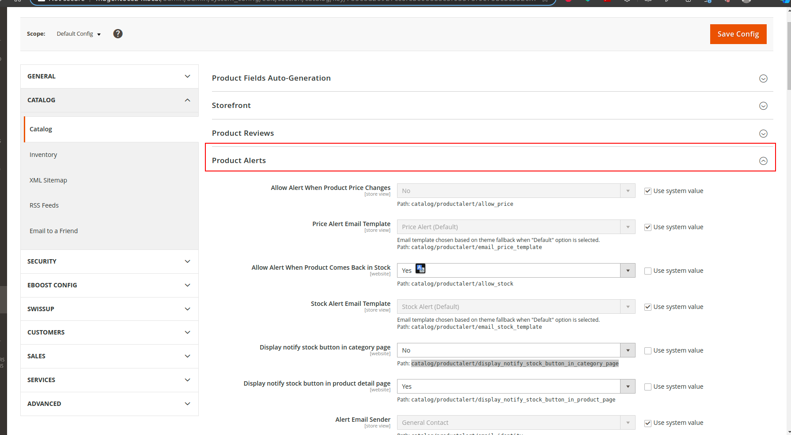

- Change  `Allow Alert When Product Comes Back in Stock`'s value  to turn On/Off the notify button. 
- Change "Display notify stock button in category page"'s value to turn On/Off the notify button on the category page.
- Change "Display notify stock button in product detail page"'s value to turn On/Off the notify button on the product page.

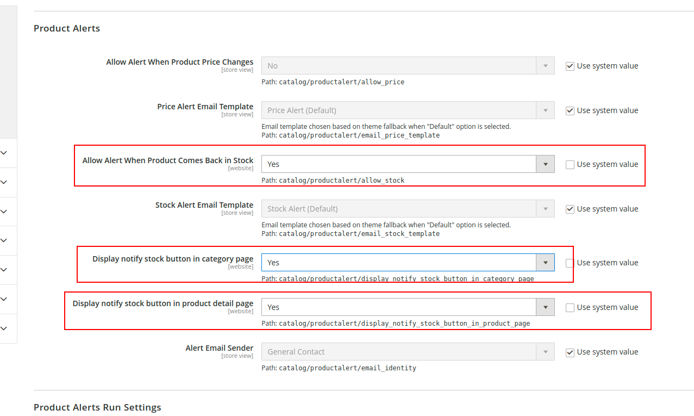

- Click `Save Config`

- Go to `Cache Management -> Flush magento cache`

- Go to frontend and check

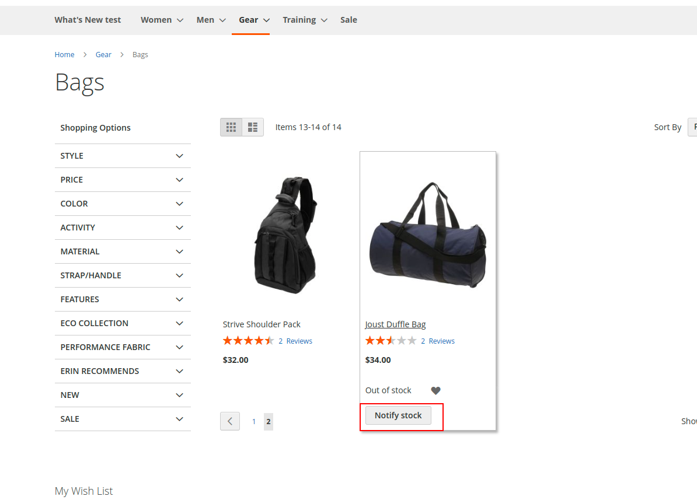
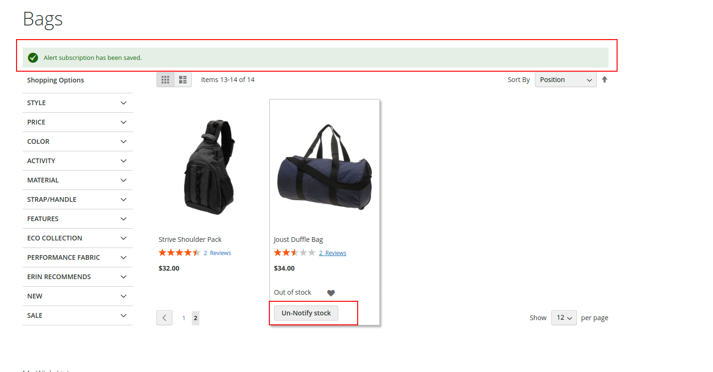
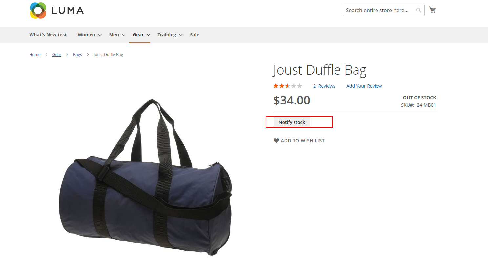
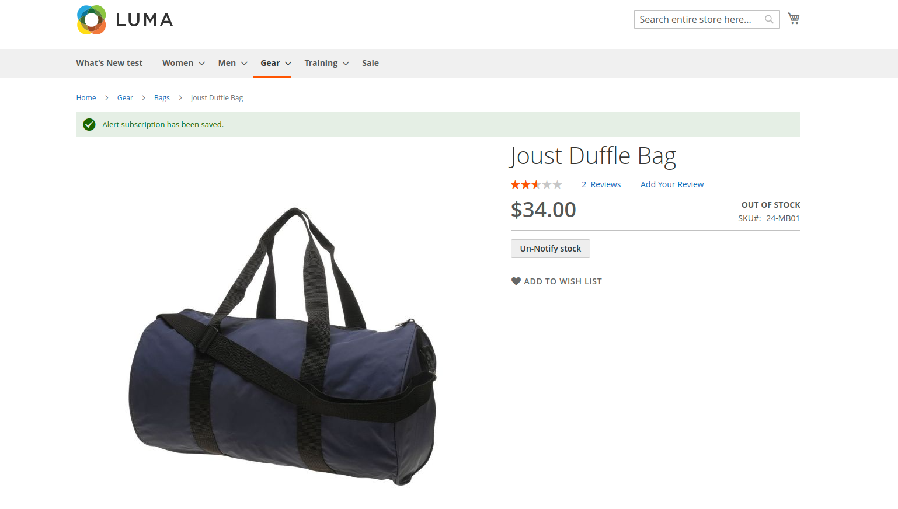
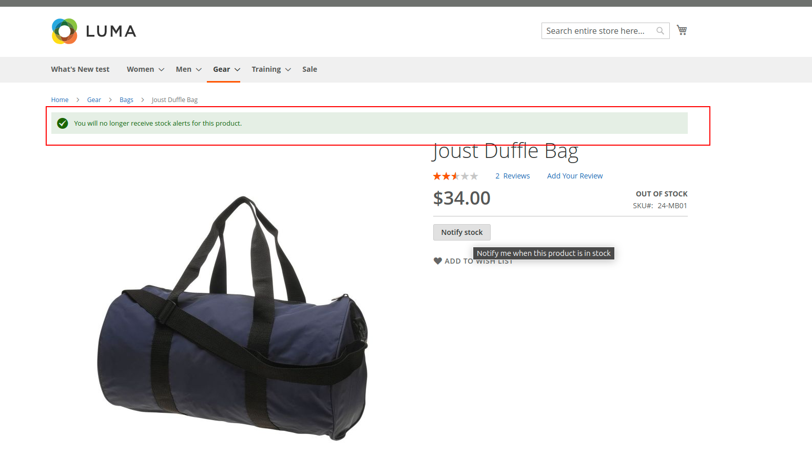

### Custom Email templates

1. Go to Marketing -> Email templates -> Add New Template

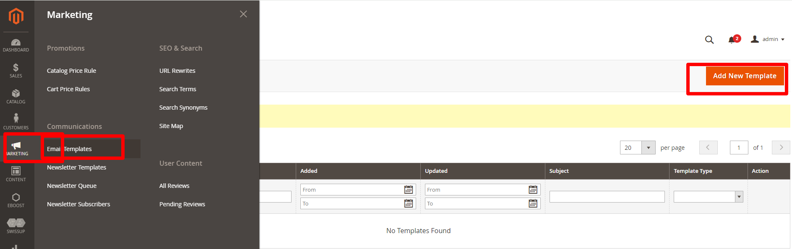

2. Go to Eboost > Configuration -> Catalog-> Product Alerts section

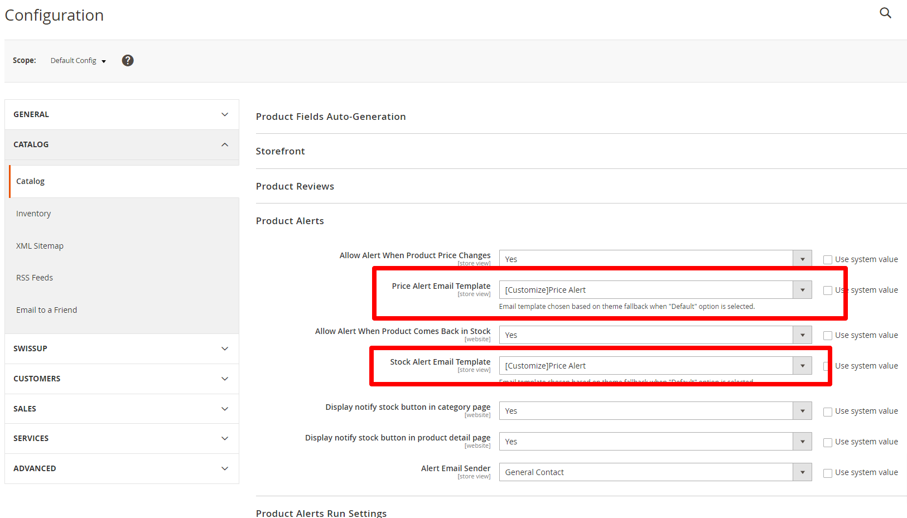

3. Select`Stock Alert` option ->  click `Load template` button

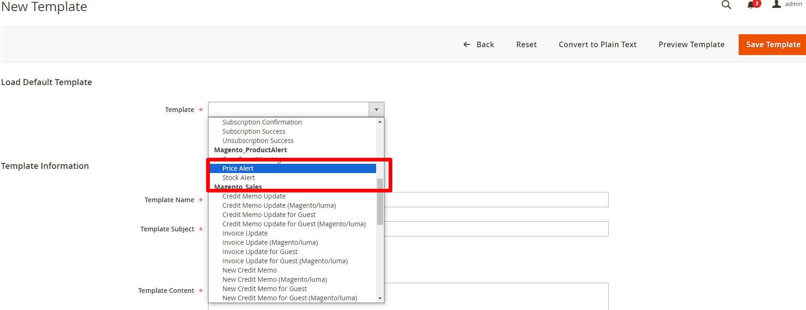

4. Add a Name & add code, HTMl, CSS for content ->  click `Save template` button

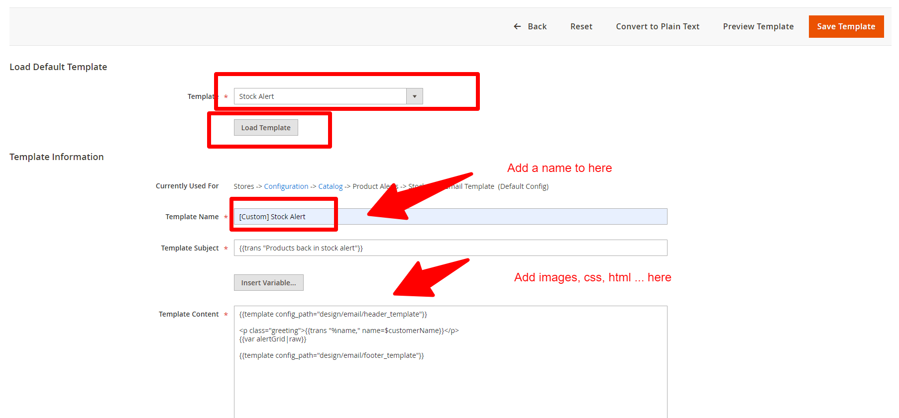

5. Repeate from step 1 to step 4 if you want to create a custom template for `Price Alert`

6. Select the new template that you have just created at step2


## Bugs/Feature Requests & Contribution

Please do open a pull request on GitHub should you want to contribute, or create an issue.

## License
[BSD-4-Clause](http://directory.fsf.org/wiki/License:BSD_4Clause) - Do as you wish 👍